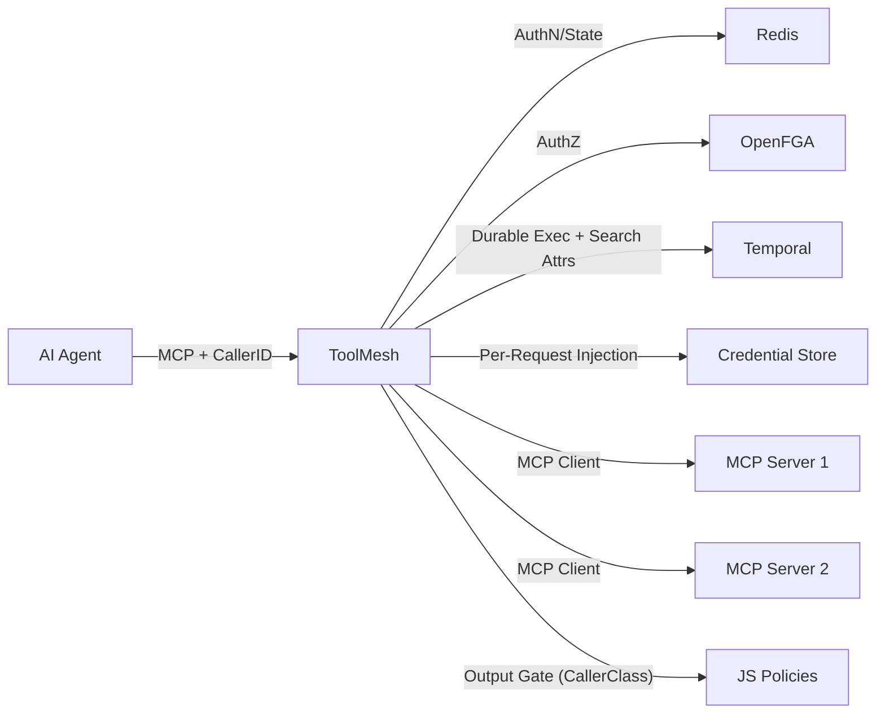

# ToolMesh

> The secure, durable execution layer between AI agents and enterprise infrastructure.

[](https://go.dev)
[](LICENSE)
[](https://github.com/DunkelCloud/ToolMesh/actions/workflows/ci.yml)
[](https://goreportcard.com/report/github.com/DunkelCloud/ToolMesh)

## The Problem

MCP gateways pass tool calls straight through. That creates real risks in production:

- **Confused Deputy** — an LLM can invoke any tool with any user's privileges
- **Credential Leakage** — API keys end up in prompts, logs, and model context
- **No Durability** — if a tool call fails mid-flight, there is no retry or audit trail
- **No Output Control** — raw backend responses flow directly to the model without filtering

ToolMesh solves this by sitting between the AI agent and your MCP servers, enforcing authorization, injecting credentials securely, providing durable execution, and gating output.

## The Six Pillars

| Pillar | What it does | Backed by |
|--------|-------------|-----------|
| **Code Mode** | LLMs write typed JS instead of error-prone JSON | AST-parsed tool calls |
| **Temporal** | Durable execution with retry, timeout, audit trail | Temporal.io |
| **OpenFGA** | Fine-grained authorization (user → plan → tool) | OpenFGA |
| **MCP Aggregation** | Connect any number of external MCP servers | Go MCP SDK |
| **Credential Store** | Inject secrets at execution time, never in prompts | Per-request injection via Executor pipeline |
| **Output Gate** | JavaScript policies filter and validate responses | goja |

## Quickstart

```bash
# Clone
git clone https://github.com/DunkelCloud/ToolMesh.git
cd ToolMesh

# Configure
cp .env.example .env
# Edit .env with your settings

# Start all services (runs in bypass mode by default — no authz required)
docker compose up -d

# Optional: Bootstrap OpenFGA and enable authorization
docker compose exec toolmesh /tm-bootstrap
# Set OPENFGA_MODE=restrict in .env and restart to enforce authz

# Connect from Claude Desktop or any MCP client
# MCP endpoint: http://localhost:8080/mcp
```

### Connect to Claude Desktop

Add to your Claude Desktop MCP config:

```json
{
  "mcpServers": {
    "toolmesh": {
      "url": "http://localhost:8080/mcp"
    }
  }
}
```

### Connect to Claude.ai (Custom Connector)

ToolMesh supports OAuth 2.1 with PKCE S256 for remote access. Configure users in `config/users.yaml` and use the public URL as the MCP endpoint.

## Authentication

ToolMesh supports two authentication methods that can be used independently or together. All OAuth state (tokens, auth codes, clients) is persisted in Redis and survives server restarts.

### OAuth 2.1 (Interactive Login)

Define users in `config/users.yaml` with bcrypt-hashed passwords:

```yaml
users:
  - username: admin
    password_hash: "$2a$10$..."
    company: dunkelcloud
    plan: pro
    roles: [admin]
```

Generate password hashes with the bootstrap tool:

```bash
docker compose exec toolmesh /tm-bootstrap hash-password "my-password"
```

For single-user setups, `TOOLMESH_AUTH_PASSWORD` still works as a fallback.

### API Keys (Programmatic Access)

Define API keys in `config/apikeys.yaml` with bcrypt-hashed keys:

```yaml
keys:
  - key_hash: "$2a$10$..."
    user_id: claude-code-user
    company_id: dunkelcloud
    plan: pro
    roles: [tool-executor]
```

Each key maps to a distinct user identity with its own plan and roles, which flow through to OpenFGA authorization.

For single-key setups, `TOOLMESH_API_KEY` still works as a fallback.

### DCR Rate Limiting

Dynamic Client Registration is rate-limited to 5 registrations per hour per IP to prevent abuse.

## Caller-Origin

ToolMesh tracks which AI client triggers each tool call. No known MCP gateway differentiates by the calling AI model — ToolMesh does.

**CallerID** is derived automatically from the authentication source:
- **OAuth clients:** The `client_name` from Dynamic Client Registration (e.g. `"claude-code"`)
- **API keys:** The `caller_id` field in `config/apikeys.yaml`
- **Anonymous:** Falls back to `"anonymous"`

**CallerClass** maps CallerIDs to trust levels via `config/caller-classes.yaml`:

```yaml
classes:
  trusted:
    - claude-code
    - claude-desktop
    - local-llm
  standard:
    - partner-*
  # Everything else defaults to "untrusted"
```

Trust levels affect the execution pipeline:

| CallerClass | PII Filtering | Tool Access | Audit |
|-------------|--------------|-------------|-------|
| `trusted` | Credentials only (AWS keys, API tokens) | Full | Temporal search attributes |
| `standard` | High-risk PII + credentials | Full | Temporal search attributes |
| `untrusted` | All PII patterns | Sensitive tools blocked | Temporal search attributes |

Temporal search attributes (`ToolMeshCallerID`, `ToolMeshCallerClass`, `ToolMeshUserID`, `ToolMeshCompanyID`, `ToolMeshToolName`) enable audit queries like:

```
ToolMeshCallerClass = "untrusted" AND ToolMeshToolName = "memorizer:retrieve_knowledge"
```

Register search attributes with: `docker compose exec toolmesh /tm-bootstrap temporal-search-attrs`

## Authorization Mode

`OPENFGA_MODE` controls whether OpenFGA authorization is enforced:

| Mode | Behavior |
|------|----------|
| `bypass` (default) | All tool calls are allowed without authz checks |
| `restrict` | OpenFGA enforces user → plan → tool authorization (requires `OPENFGA_STORE_ID`) |

Start with `bypass` to get running quickly, then switch to `restrict` after bootstrapping OpenFGA.

## Configuration

See [docs/configuration.md](docs/configuration.md) for all environment variables.

## Architecture

See [docs/architecture.md](docs/architecture.md) for the full architecture documentation.



## Adding an External MCP Server

Create or edit `config/backends.yaml`:

```yaml
backends:
  - name: memorizer
    transport: http
    url: "https://memorizer.example.com/mcp"
    api_key_env: "MEMORIZER_API_KEY"

  - name: local-tools
    transport: stdio
    command: "./my-mcp-server"
    args: ["--port", "0"]
```

Set the credential as an environment variable:

```bash
CREDENTIAL_MEMORIZER_API_KEY=sk-mem-xxxxx
```

Tools from each backend are exposed with a prefix: `memorizer:retrieve_knowledge`, `local-tools:my_tool`. Credentials are injected by the Executor at runtime via the CredentialStore — the LLM never sees API keys.

## Code Mode

Instead of raw JSON tool calls, LLMs can use typed JavaScript:

```javascript
// List available tools with TypeScript definitions
const tools = await toolmesh.list_tools();

// Execute tools with typed parameters
const result = await toolmesh.memorizer_retrieve_knowledge({
  query: "project architecture",
  top_k: 5
});
```

ToolMesh parses the code, extracts tool calls, and routes them through the full execution pipeline (AuthZ → Credentials → Backend → Output Gate).

## Extension Model

ToolMesh uses a registry-based extension model inspired by Go's `database/sql` driver pattern. Three component types are extensible via `init()` registration:

| Component | Built-in | Config |
|-----------|----------|--------|
| Credential Store | `embedded` | `CREDENTIAL_STORE=<name>` |
| Tool Backend | `mcp`, `echo` | `config/backends.yaml` |
| Output Gate Evaluator | `goja` | `GATE_EVALUATORS=<list>` |

Enterprise extensions (InfisicalStore, VaultStore, Compliance-LLM, etc.) are available separately and included via Go build tags: `go build -tags enterprise ./cmd/toolmesh`.

See [docs/architecture.md](docs/architecture.md#extension-model) for details.

## Contributing

See [CONTRIBUTING.md](CONTRIBUTING.md).

## License

Apache 2.0 — Copyright 2025 [Dunkel Cloud GmbH](https://dunkel.cloud)
