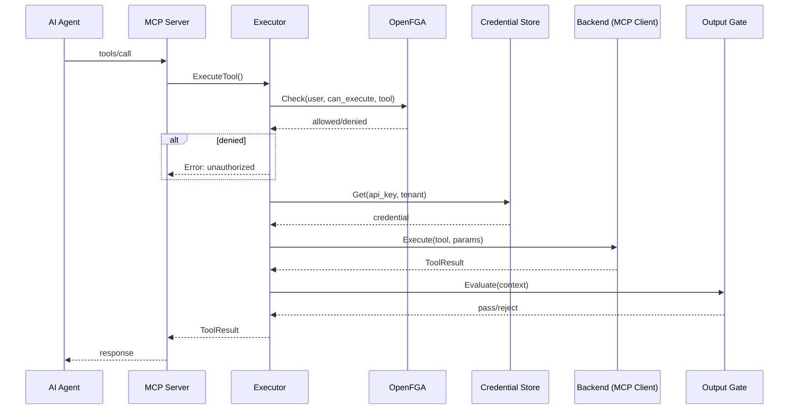

# ToolMesh Architecture

## Overview

ToolMesh is a secure, durable execution layer (middleware) between AI agents and enterprise infrastructure. It is **not** a tool itself — it orchestrates, authorizes, and secures the execution of tool calls on external MCP servers.

## The Six Pillars

### 1. Code Mode

LLMs can write typed JavaScript instead of error-prone JSON for tool calls. ToolMesh exposes two special tools:

- `list_tools` — returns TypeScript interface definitions for all available tools
- `execute_code` — accepts JavaScript code, extracts tool calls, and executes them through the pipeline

The JavaScript is parsed (not executed) to extract function names and parameters.

### 2. Audit (Execution Trail)

Every tool execution is recorded as an audit entry. The audit store is pluggable:

- **`log` (default)** — structured slog output, zero dependencies, write-only
- **`sqlite`** — append-only SQLite database with indexed columns, queryable via SQL
- **Timeout enforcement** via `context.WithTimeout` on backend calls (`TOOLMESH_EXEC_TIMEOUT`)
- **Retries** handled by DADL `errors.retry_strategy` for REST backends

### 3. OpenFGA (Authorization)

Fine-grained authorization using a relationship-based model:

```
user → subscribes to → plan → associated with → tool
```

The authorization check happens before any tool execution (fail-closed). If OpenFGA denies the request, the pipeline stops immediately.

### 4. MCP Aggregation

The MCPAdapter connects to multiple external MCP servers and aggregates their tools:

- Tools are prefixed with the backend name: `memorizer:retrieve_knowledge`
- Routing is automatic based on the prefix
- Both HTTP (Streamable HTTP) and STDIO transports are supported

### 5. Credential Store

Credentials are injected at execution time within the executor pipeline scope. They never appear in prompts, logs, or model context.

Phase 1 uses an environment-variable-based store (`CREDENTIAL_<NAME>=value`).

### 6. Output Gate

A JavaScript policy engine (powered by goja) evaluates every tool result before it reaches the caller. Policies can:

- Reject requests (throw an error)
- Check rate limits
- Validate authentication state
- Filter or modify response content

## Execution Pipeline



## Project Structure

```
toolmesh/
├── cmd/
│   ├── toolmesh/       # Main entrypoint (MCP Server)
│   └── tm-bootstrap/   # CLI: Load OpenFGA model, write example tuples
├── internal/
│   ├── mcp/            # MCP Server (Streamable HTTP + STDIO)
│   ├── backend/        # ToolBackend interface + MCPAdapter
│   ├── executor/       # ExecuteTool pipeline (AuthZ → Creds → Gate → Exec → Audit)
│   ├── audit/          # Audit store interface + log/sqlite implementations
│   ├── authz/          # OpenFGA authorization
│   ├── credentials/    # Credential store interface + EmbeddedStore
│   ├── gate/           # Output Gate (goja policy engine)
│   ├── userctx/        # UserContext propagation
│   └── config/         # Environment-based configuration
├── config/             # Backend configuration (backends.yaml)
├── tools/              # TypeScript tool definitions (canonical source)
└── docs/               # Documentation
```

## Extension Model

ToolMesh uses a registry-based extension model inspired by Go's `database/sql`
driver pattern. Three component types are extensible:

| Component | Registry | Built-in | Extension Point |
|-----------|----------|----------|-----------------|
| Credential Store | `credentials.Register()` | `embedded` | `CREDENTIAL_STORE=<name>` |
| Tool Backend | `backend.Register()` | `mcp`, `echo` | `config/backends.yaml` |
| Output Gate Evaluator | `gate.RegisterEvaluator()` | `goja` | `GATE_EVALUATORS=<list>` |

Extensions register themselves via `init()` functions. Enterprise extensions
live in a separate module and are included via Go build tags:

```
go build -tags enterprise ./cmd/toolmesh
```

The open-source core includes all interfaces and the built-in implementations.
Enterprise implementations (InfisicalStore, VaultStore, Compliance-LLM evaluator,
etc.) are available separately.
